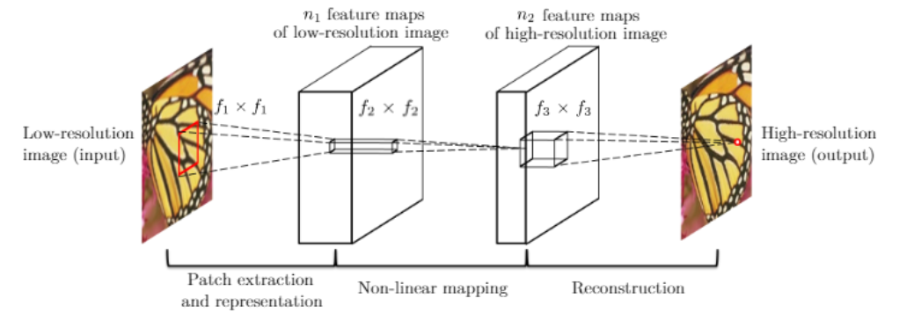

# SRCNN

## 原理

考虑一个单一低分辨率图像，我们首先使用双三次插值将其放大到所需的大小，这是我们进行的唯一预处理。我们将插值后的图像表示为Y。我们的目标是从Y中恢复出一个图像F(Y)，使其尽可能地与真实高分辨率图像X相似。为了方便表达，我们仍然将Y称为“低分辨率”图像，尽管它的大小与X相同。我们希望学习一个映射F，它在概念上包括三个操作：

1. **Patch提取和表示：** 该操作从低分辨率图像Y中提取（重叠的）补丁，并将每个补丁表示为高维向量。这些向量组成一组特征图，其数量等于向量的维度。

   $$
   F1(Y) = \max(0, W1 * Y + B1)
   $$

   其中W1和B1分别表示滤波器和偏差，'*'表示卷积操作。这里，W1对应于支持$c×f1×f1$的n1个滤波器，其中c是输入图像的通道数，$f1$是滤波器的空间尺寸。直观地说，$W1$在图像上应用n1次卷积，每个卷积具有内核大小$c×f1×f1$。输出由n1个特征图组成。B1是一个n1维向量，其每个元素与一个滤波器相关联。在滤波器响应上应用修正线性单元（ReLU，$\max(0, x)$）。
2. **非线性映射：** 该操作将每个高维向量非线性映射到另一个高维向量。每个映射的向量在概念上是高分辨率补丁的表示。这些向量构成另一组特征图。

   $$
   F2(Y) = \max(0, W2 * F1(Y) + B2)
   $$
3. **重建：** 该操作聚合上述高分辨率补丁的表示，生成最终的高分辨率图像。这个图像预期与真实的X相似。

   $$
   F2(Y) = \max(0, W2 * F1(Y) + B2)
   $$

网络的概览如图所示。



```python
class SRCNN(nn.Module):
    def __init__(self):
        super(SRCNN, self).__init__()
        self.conv1 = default_conv(in_channels=3, out_channels=64, kernel_size=9, padding=4, bias=False, init_scale=0.1)
        self.conv2 = default_conv(in_channels=64, out_channels=32, kernel_size=1, padding=0, bias=False, init_scale=0.1)
        self.conv3 = default_conv(in_channels=32, out_channels=3, kernel_size=5, padding=2, bias=False, init_scale=0.1)
        self.relu = nn.ReLU(inplace=True)
    def forward(self, x):
        out = self.relu(self.conv1(x))
        out = self.relu(self.conv2(out))
        out = self.conv3(out)
        return out
```

## 训练

学习端到端映射函数F需要估计网络参数Θ = {W1，W2，W3，B1，B2，B3}。这通过最小化重建图像F(Y; Θ)与相应的地面真实高分辨率图像X之间的损失来实现。给定一组高分辨率图像{Xi}及其相应的低分辨率图像{Yi}，我们使用均方误差（MSE）作为损失函数：

$$
L(\Theta) = \frac{1}{n} \sum_{i=1}^{n} \|F(Y_i; \Theta) - X_i\|_2^2
$$

## 实验

### SRCNN（单通道）

输出图像保存在/output/SRCNN-SC/

|      | LR                             | PSNR   | HR                               | PSNR   |
| ---- | ------------------------------ | ------ | -------------------------------- | ------ |
| img1 |  | 32.642 |  | 33.138 |
| img2 |  | 31.152 |  | 32.089 |
| img3 |  | 22.729 |  | 23.912 |
| img4 |  | 31.618 |  | 31.859 |
| img5 |  | 27.237 |  | 28.214 |

### VDSR与SRCNN(三通道)

VDSR和SRCNN的输出分别保存在/output/VDSR和/output/SRCNN-TC

|      |             LR             | PSNR   | HR<br />VDSR                 | PSNR   | HR<br />SRCNN                    | PSNR   |
| ---- | :------------------------: | ------ | ---------------------------- | ------ | -------------------------------- | ------ |
| img1 |  | 32.642 |  | 32.891 |  | 27.505 |
| img2 |  | 31.152 |  | 31.138 |  | 27.255 |
| img3 |  | 22.729 |  | 26.590 |  | 22.995 |
| img4 |  | 31.618 |  | 32.247 |  | 29.671 |
| img5 |  | 27.237 |  | 30.044 |  | 27.852 |
